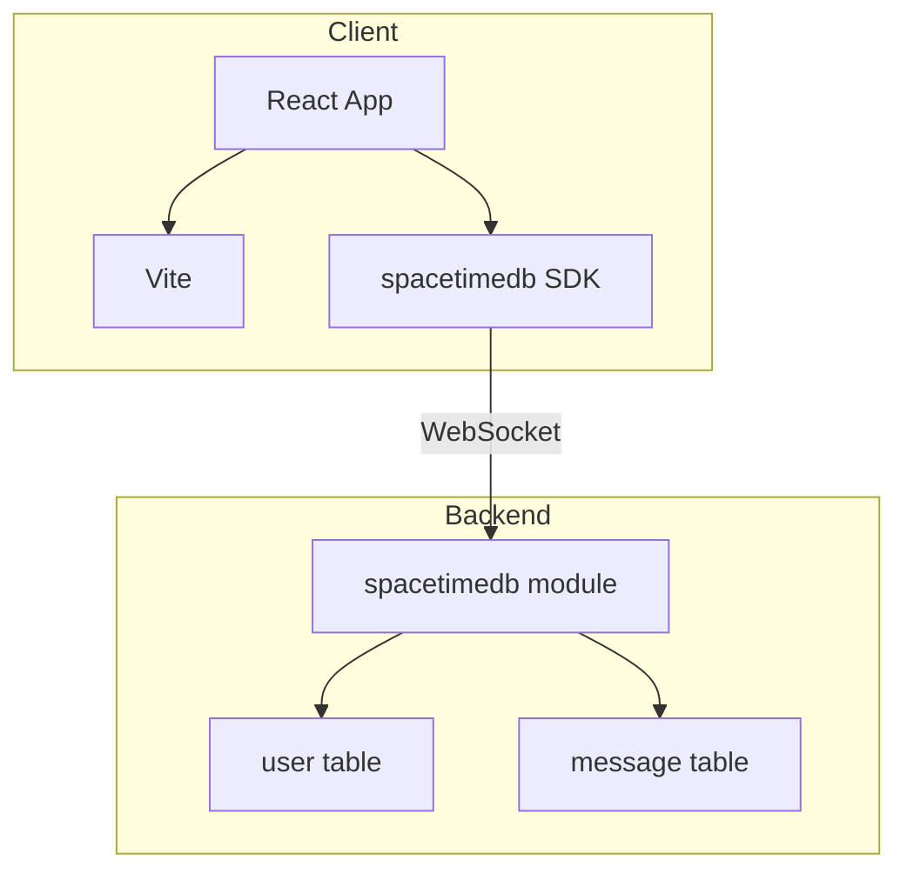

<!-- PRESERVATION RULE: Never delete or replace content. Append or annotate only. -->

# ARCHITECTURE

## System Structure

## Directories
- `src/` — React app (main.tsx, App.tsx, module_bindings)
- `spacetimedb/` — SpacetimeDB TypeScript module (user, message tables; set_name, send_message reducers)
- `DOCS/` — Project docs and SpacetimeDB ideas

## Links

- [SpacetimeDB Home](https://spacetimedb.com/home) · [Docs](https://spacetimedb.com/docs)

## Data Flow
1. Client connects via `DbConnection` to SpacetimeDB (local or maincloud)
2. `clientConnected` creates/updates user row
3. User calls `set_name`, `send_message` reducers
4. Tables drive UI via `useTable`
